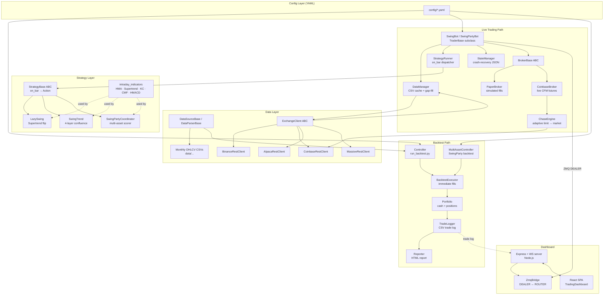

# Swinger — System Architecture

## 1. System Overview

Swinger is a **quantitative trend-following trading system** built around a BTC/USDT 5-minute bar intraday strategy. It is composed of three operating modes that share the same core abstractions:

- **Backtesting** — replay historical OHLCV data through a strategy and produce an HTML performance report.
- **Live / Paper Trading** — a daemon that polls a live exchange feed, runs the same strategy logic tick-by-tick, and routes orders through a pluggable broker (real Coinbase CFM futures or a local paper simulator).
- **Multi-asset rotation (SwingParty)** — a portfolio coordinator that ranks N assets and dynamically allocates capital to the strongest signals, both in backtest and live modes.

A **web dashboard** (Node.js + React) connects to running bots over ZeroMQ to provide real-time portfolio monitoring and trade history.

The primary champion strategies are **LazySwing v4** (Supertrend flip, always-in-market, single-asset) and **SwingParty** (multi-asset portfolio rotation built on top of LazySwing signals).

---

## 2. Architecture Diagram



---

## 3. Core Components

### 3.1 Strategy Layer (`src/strategies/`)

The strategy layer is a **pure signal generator**. Every strategy subclasses `StrategyBase` and implements a single method:

```
on_bar(data: DataFrame, portfolio: PortfolioView) → Action
```

`Action` is a typed value object (`BUY / SELL / SHORT / COVER / HOLD`) with an optional quantity. Strategies never touch money or execute orders — that responsibility belongs entirely to the executor or broker below them.

| Strategy | Mechanism |
|---|---|
| `LazySwingStrategy` | Rides Supertrend flips on 1h-resampled bars; always-in-market (long or short) |
| `SwingTrendStrategy` | 4-layer confluence: regime (ADX), direction (Supertrend), entry (KC triggers + MACD), risk (ST stop gate) |
| `SwingPartyCoordinator` | Scores N assets via a pluggable `ScorerBase`, allocates capital to the top-K, evicts weak holdings |

Shared technical indicator computations (HMA, Supertrend, Keltner Channels, CMF, HMACD, Bollinger, etc.) live in `intraday_indicators.py` and are used by all strategies.

---

### 3.2 Backtest Engine (`src/controller.py`, `src/execution/`)

`Controller` orchestrates a single-asset backtest:

1. Loads a YAML config via `Config`.
2. Resolves the `DataSource` and `DataParser` from their registries, producing a normalized OHLCV `DataFrame`.
3. Instantiates the strategy from the `STRATEGY_REGISTRY`.
4. Feeds each bar to `strategy.on_bar()` and routes the returned `Action` to `BacktestExecutor`.
5. `BacktestExecutor` applies fills immediately at bar-close price against a `Portfolio` object and records each fill to `TradeLogger`.
6. After the loop, a `Reporter` renders an HTML report with Plotly charts and trade statistics.

`MultiAssetController` extends this for SwingParty: it loads N DataFrames (one per asset), iterates over a union timestamp index, and feeds the `SwingPartyCoordinator` at each tick.

---

### 3.3 Live Trading Daemon (`src/trading/`)

`SwingBot` (and its multi-asset sibling `SwingPartyBot`) subclass `TraderBase`, which provides the event loop, ZMQ communication, and pause/resume/force-close lifecycle.

The daemon is structured as a set of collaborating components, each with a single responsibility:

| Component | Responsibility |
|---|---|
| `DataManager` | Maintains monthly OHLCV CSV files; fills gaps from the exchange on startup and between ticks; abstracts the "feed horizon" (supports `feed_delay_minutes` for delayed data plans) |
| `StrategyRunner` | Builds the warm-up window, calls `strategy.on_bar()`, and returns the current `Action` |
| `BrokerBase` impl. | Executes orders, tracks fills, owns portfolio state, and persists broker-side state to disk |
| `StateManager` | Writes a crash-recovery JSON snapshot after every fill; can restore mid-position on restart |

The **Broker abstraction** (`src/brokers/`) decouples order execution from bot orchestration:

- `PaperBroker` — simulates limit-order fulfillment locally using a `FulfillmentEngine` (static target price + abort logic).
- `CoinbaseBroker` — routes orders to Coinbase CFM futures via `ChaseEngine`, an adaptive limit-order chaser that reprices every few seconds and falls back to a market IOC if the position drifts too far from target.

---

### 3.4 Exchange Client (`src/exchange/`)

`ExchangeClient` is an ABC that exposes three primitives: `fetch_ohlcv`, `get_current_price`, and `get_best_bid_ask`. Concrete implementations (Binance, Coinbase, Alpaca, Massive) are registered in `exchange/registry.py` and resolved by name from config. The bot layer only depends on the ABC, making exchange backends fully swappable without touching strategy or broker logic.

---

### 3.5 Dashboard (`dashboard/`)

The dashboard is a standalone Node.js / React application that observes running bots without coupling to the Python runtime.

**Server** (`dashboard/server/`):
- Express serves the REST API (`/api/bots`, OHLCV data, trade logs) and authenticates users via `config/users.yaml`.
- A `ZmqBridge` maintains a ZMQ ROUTER socket; each bot connects as a DEALER and pushes structured messages (`hello`, `trade_entry`, `trade_exit`, `heartbeat`, `portfolio_update`).
- `BotStateManager` merges ZMQ live state with file-system state (scanned from `data/<user>/` directories) to produce a unified view of all bots.
- `ProcessManager` allows starting/stopping bots via the API.

**Client** (`dashboard/client/`):
- React SPA (`TradingDashboard`) uses a `useWebSocket` hook to receive real-time portfolio and trade updates pushed from the server.
- Price charts use `lightweight-charts`; portfolio value history uses a separate chart component.

---

### 3.6 Weekly Screener / Nasdaq Rotation (`src/weekly_screener_core.py`)

A separate pipeline (not part of the real-time loop) that runs weekly:

1. Downloads daily OHLCV for a Nasdaq universe via `MassiveRestClient`.
2. Scores each symbol using pluggable scoring methods (momentum, ROC acceleration, volume breakout × ADX).
3. Selects the top-K candidates for the coming week.
4. Generates an HTML scorecard and appends a ledger row for historical performance tracking.
5. Optionally kicks off multi-asset backtests for the selected portfolio.

---

## 4. Data Flow

### 4.1 Backtest Critical Path

```
YAML config
  └─► Config.load()
        └─► DataSource.fetch() + DataParser.parse()
              └─► OHLCV DataFrame (5m bars, date-filtered)
                    └─► Strategy.prepare(full_data)       ← precompute indicators
                          └─► [for each bar]
                                Strategy.on_bar(bar, PortfolioView)
                                  └─► Action { BUY | SELL | SHORT | COVER | HOLD }
                                        └─► BacktestExecutor.execute(action, price)
                                              └─► Portfolio (cash ↔ positions)
                                                    └─► TradeLogger.record(fill)
                                                          └─► Reporter.render()
                                                                └─► reports/*.html
```

Key invariant: the `PortfolioView` passed to `on_bar()` is a **frozen read-only snapshot** — strategies cannot mutate portfolio state directly. This ensures the strategy is a pure function of market data and current position.

---

### 4.2 Live Trading Critical Path

```
Startup
  └─► DataManager.backfill()               ← pull missing bars from exchange
        └─► StrategyRunner.warm_up()        ← feed historical bars to build indicator state

[Every 5-minute bar close]
  └─► DataManager.fetch_and_append()       ← append latest closed bar to monthly CSV
        └─► StrategyRunner.on_bar()         ← run strategy on current bar
              └─► Action
                    └─► Broker.execute_order(side, qty, symbol)
                          ├─► [PaperBroker]    FulfillmentEngine → simulated FillResult
                          └─► [CoinbaseBroker] ChaseEngine.start()
                                                  └─► GTC limit order placed
                                                        └─► [periodic check()]
                                                              ├─► FILLED → FillResult
                                                              ├─► repriced → re-post order
                                                              └─► timeout → market IOC

  └─► FillResult
        ├─► TradeLogger.append(fill)        ← CSV trade log
        ├─► StateManager.save_snapshot()    ← crash-recovery JSON
        └─► TraderBase._send_zmq(msg)       ← push update to dashboard
```

### 4.3 ZMQ Message Protocol (Bot → Dashboard)

Bots send typed JSON frames over a ZMQ DEALER socket. The dashboard server's ROUTER receives and fans them out to connected WebSocket clients. Message types: `hello` (registration), `trade_entry`, `trade_exit`, `portfolio_update`, `heartbeat`, `paused`, `resumed`, `force_close`.
