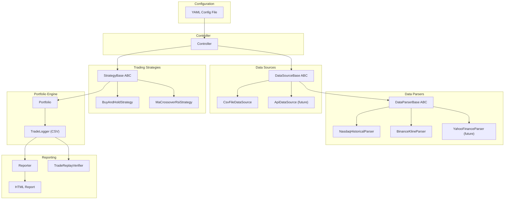
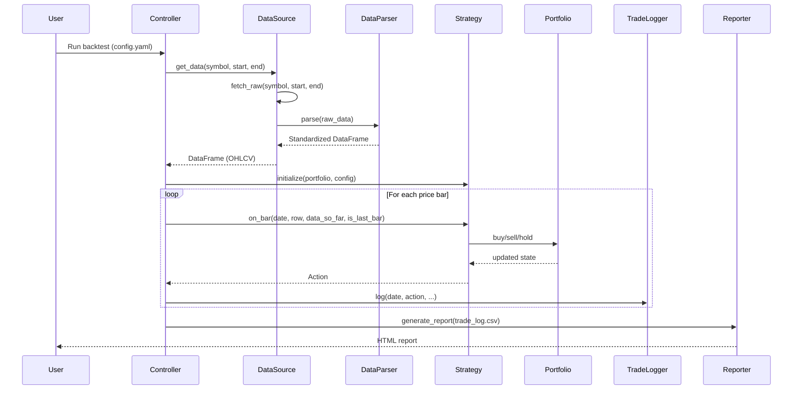

# Detailed Design: Backtesting & Trading System

## Project Structure

```
swinger/
  src/
    swinger/                      # Main Python package
      __init__.py
      portfolio.py                # Portfolio + Position classes
      trade_log.py                # TradeLogger + TradeLogReader (CSV)
      config.py                   # YAML config loader          [Phase 4]
      controller.py               # Orchestrator                [Phase 4]
      data_sources/
        __init__.py               # Re-exports DataSourceBase, registries
        base.py                   # DataSourceBase ABC
        csv_file.py               # CsvFileDataSource
        registry.py               # PARSER_REGISTRY + DATA_SOURCE_REGISTRY
        parsers/
          __init__.py
          base.py                 # DataParserBase ABC + STANDARD_COLUMNS
          nasdaq.py               # NasdaqHistoricalParser (Nasdaq CSV format)
          binance.py              # BinanceKlineParser (handles ms + µs timestamps)
      strategies/
        __init__.py               # Re-exports StrategyBase, Action, strategies
        base.py                   # StrategyBase ABC, Action, ActionType
        buy_and_hold.py           # BuyAndHoldStrategy
        ma_crossover_rsi.py       # MaCrossoverRsiStrategy      [Phase 7]
        registry.py               # STRATEGY_REGISTRY           [Phase 4]
      reporting/
        __init__.py
        reporter.py               # HTML report generator       [Phase 5]
        templates/
          report.html             # Jinja2 template             [Phase 5]
    data_sources/
      download_binance.py         # Reusable Binance data downloader
  tests/
    __init__.py
    test_parsers.py               # 13 tests -- Nasdaq + Binance parsers
    test_data_sources.py          # 12 tests -- CsvFileDataSource + registries
    test_portfolio.py             # 14 tests -- Portfolio buy/sell/value
    test_trade_log.py             # 3 tests  -- TradeLogger round-trip
    test_strategies.py            # 6 tests  -- BuyAndHoldStrategy
    test_controller.py            # Integration tests           [Phase 4]
    test_reporting.py             # Reporting tests             [Phase 5]
    test_trade_replay.py          # P/L verification tests      [Phase 6]
  data/
    QQQ-HistoricalData.csv        # Nasdaq daily QQQ data
    BTCUSDT-5m-20240101-20260131.csv   # Binance 5-min BTC/USDT  (33 MB, 219,456 bars)
    BTCUSDT-1m-20240101-20260131.csv   # Binance 1-min BTC/USDT  (161 MB, 1,097,280 bars)
    5m/monthly/                   # Source monthly ZIP extracts
    1m/monthly/
  reports/                        # Generated HTML reports (output)
  tmp/                            # Throwaway files
  docs/                           # Project documentation
    rules.md
    decisions.md
    session-context.md
    detailed design.md
    high level requirements.md
  config/
    backtest_example.yaml         # Sample config               [Phase 4]
  .venv/                          # Python virtual environment
  requirements.txt
```

---

## Core Data Model

### Price Data (pandas DataFrame)

All data sources produce a standardized DataFrame via their parser. Regardless of the
raw format (Nasdaq CSV, Yahoo CSV, API JSON, etc.), the output is always:

- **date** - datetime - Trading date (index)
- **open** - float - Opening price
- **high** - float - High price
- **low** - float - Low price
- **close** - float - Closing price
- **volume** - int - Volume traded

### Data Source / Data Parser Architecture

The data layer is split into two concerns:

- **DataParserBase** -- knows *how* to normalize a specific raw format into the standard DataFrame
- **DataSourceBase** -- knows *where/how* to fetch raw data, delegates to a parser for normalization

This separation means:
- Adding a new file format = write a new parser only
- Adding a new fetch mechanism (API, websocket) = write a new data source, reuse existing parsers
- The controller only calls `data_source.get_data()` and always gets the same standardized DataFrame

```python
class DataParserBase(ABC):
    """Knows how to normalize a specific raw data format into
    the standard OHLCV DataFrame."""

    @abstractmethod
    def parse(self, raw_data) -> pd.DataFrame:
        pass

class DataSourceBase(ABC):
    """Knows where/how to fetch raw data. Delegates parsing to a DataParser."""

    def __init__(self, parser: DataParserBase, config: dict):
        self.parser = parser
        self.config = config

    @abstractmethod
    def fetch_raw(self, symbol: str, start_date, end_date) -> Any:
        """Fetch raw data from the underlying source."""
        pass

    def get_data(self, symbol: str, start_date, end_date) -> pd.DataFrame:
        """Fetch + parse + date-filter. This is what the controller calls."""
        raw = self.fetch_raw(symbol, start_date, end_date)
        df = self.parser.parse(raw)
        return df[(df.index >= start_date) & (df.index <= end_date)]
```

**Concrete implementations:**

- `NasdaqHistoricalParser` -- handles Nasdaq format (`Date,Close/Last,Volume,Open,High,Low` with MM/DD/YYYY dates)
- `BinanceKlineParser` -- handles Binance kline format; auto-detects ms vs µs timestamps (ms pre-2025, µs from Jan 2025)
- `CsvFileDataSource` -- reads a local file path, passes contents to the configured parser
- `ApiDataSource` (future) -- fetches from a REST API, passes response to the configured parser

**Registries** (in `src/swinger/data_sources/registry.py`):

```python
PARSER_REGISTRY = {
    "nasdaq_historical": NasdaqHistoricalParser,
    "binance_kline": BinanceKlineParser,
}

DATA_SOURCE_REGISTRY = {
    "csv_file": CsvFileDataSource,
}
```

### Trade Log CSV Format (uniform across all strategies)

- **date** - ISO date of the decision
- **action** - One of: `BUY`, `SELL`, `HOLD`
- **symbol** - Ticker symbol
- **quantity** - Number of shares/units (0 for HOLD)
- **price** - Execution price
- **cash_balance** - Cash after the action
- **portfolio_value** - Total portfolio value (cash + holdings)
- **details** - JSON string with strategy-specific reasoning (escaped to not break CSV)

### Portfolio Model (`src/swinger/portfolio.py`)

```python
@dataclass
class Position:
    symbol: str
    quantity: float
    avg_cost: float

    @property
    def cost_basis(self) -> float: ...

class Portfolio:
    cash: float
    initial_cash: float
    positions: dict[str, Position]

    def total_value(self, current_prices: dict[str, float]) -> float: ...
    def buy(self, symbol, quantity, price) -> None: ...   # raises on insufficient cash
    def sell(self, symbol, quantity, price) -> None: ...  # raises on over-sell
```

### Strategy Model (`src/swinger/strategies/base.py`)

```python
class ActionType(str, Enum):
    BUY = "BUY"
    SELL = "SELL"
    HOLD = "HOLD"

@dataclass
class Action:
    action: ActionType
    quantity: float = 0.0
    details: dict = field(default_factory=dict)

class StrategyBase(ABC):
    def __init__(self, portfolio: Portfolio, config: dict): ...

    @abstractmethod
    def on_bar(self, date, row, data_so_far, is_last_bar: bool) -> Action: ...
```

---

## Phase 1: Project Foundation & Data Layer

**Goal:** Load price data from files into a standardized DataFrame, with a clean separation between fetching and parsing.

- [x] Set up Python project with `requirements.txt` (pandas, pyyaml, jinja2, plotly, pytest)
- [x] Define `DataParserBase` ABC in `swinger/data_sources/parsers/base.py` with method `parse(raw_data) -> pd.DataFrame`
- [x] Define `DataSourceBase` ABC in `swinger/data_sources/base.py` with `fetch_raw()` and `get_data()` methods (get_data calls fetch_raw then delegates to parser)
- [x] Implement `NasdaqHistoricalParser` in `swinger/data_sources/parsers/nasdaq.py` -- maps Nasdaq CSV columns (`Date,Close/Last,Volume,Open,High,Low`) to standard OHLCV format
- [x] Implement `BinanceKlineParser` in `swinger/data_sources/parsers/binance.py` -- handles ms/µs timestamps
- [x] Implement `CsvFileDataSource` in `swinger/data_sources/csv_file.py` -- reads a local CSV file path and passes content to its parser
- [x] Use existing `data/QQQ-HistoricalData.csv` and Binance CSVs as real test data files
- [x] Set up `PARSER_REGISTRY` and `DATA_SOURCE_REGISTRY` dicts
- [x] **Tests:**
  - [x] Parser unit tests: feed raw Nasdaq CSV text to `NasdaqHistoricalParser`, verify standardized DataFrame columns, date parsing, correct value mapping (`Close/Last` -> `close`)
  - [x] Parser unit tests: feed raw Binance CSV with both ms and µs timestamps to `BinanceKlineParser`
  - [x] Data source tests: `CsvFileDataSource` + `NasdaqHistoricalParser` end-to-end, verify date filtering, handling of missing data
  - [x] Data source tests: `CsvFileDataSource` + `BinanceKlineParser` end-to-end, including ms/µs boundary
  - [x] Test that parser and data source registries resolve correct classes

## Phase 2: Portfolio Model & Trade Logging

**Goal:** A working portfolio that tracks cash, positions, and P/L, plus a CSV trade logger.

- [x] Implement `Portfolio` class with buy/sell/total_value methods, input validation (no negative cash, no selling more than owned)
- [x] Implement `TradeLogger` in `swinger/trade_log.py` that writes rows to CSV in the standardized format, and a `TradeLogReader` that reads a trade log back
- [x] **Tests:** Portfolio buy/sell math, edge cases (buy with insufficient cash, sell more than held), trade log round-trip (write then read and verify)

## Phase 3: First Strategy -- Buy-and-Hold

**Goal:** A runnable strategy that produces a trade log.

- [x] Define `StrategyBase` ABC in `swinger/strategies/base.py` with:
  - `__init__(self, portfolio, config)` 
  - `on_bar(self, date, row, data_so_far, is_last_bar) -> Action` called for each price bar
  - `Action` dataclass: `action` (BUY/SELL/HOLD), `quantity`, `details`
- [x] Implement `BuyAndHoldStrategy` in `swinger/strategies/buy_and_hold.py`:
  - First bar: BUY with all cash
  - Last bar: SELL all holdings
  - All other bars: HOLD
- [x] **Tests:** Run Buy-and-Hold on sample data, verify exactly 1 buy + N-2 holds + 1 sell, verify final P/L matches `(end_price / start_price - 1) * initial_cash`

## Phase 4: Controller & Configuration

**Goal:** A config-driven controller that wires everything together and runs a backtest.

- [x] Define YAML config schema:

```yaml
backtest:
  name: "QQQ Buy and Hold 2025"
  initial_cash: 100000
  start_date: "2025-01-01"
  end_date: "2025-12-31"

data_source:
  type: "csv_file"
  parser: "nasdaq_historical"
  params:
    file_path: "data/QQQ-HistoricalData.csv"
    symbol: "QQQ"

strategies:
  - type: "buy_and_hold"
    params: {}
```

- [x] Implement `Config` loader in `swinger/config.py` using PyYAML
- [x] Implement `Controller` in `swinger/controller.py` that:
  1. Loads config
  2. Instantiates data source via a registry/factory pattern
  3. Instantiates strategy(ies) via a registry/factory pattern
  4. Iterates through price bars calling `strategy.on_bar()`
  5. Writes trade log CSV
  6. Returns results summary (BacktestResult)
- [x] Use a simple registry dict mapping `type` string to class for both data sources and strategies
- [x] **Tests:** Full integration test -- load config, run controller, verify trade log output exists and is correct (9 tests)

## Phase 5: HTML Reporting

**Goal:** Generate styled, interactive HTML reports with linked charts and a stats summary table.

### Chart Layout

The report uses a **Plotly figure with two vertically-linked subplots** sharing the same x-axis (time), so panning/zooming one panel moves the other in sync.

**Top panel -- Asset Price + Trade Markers**
- Line chart of asset close price over the full simulation period
- BUY events shown as upward green triangle markers on the price line
- SELL events shown as downward red triangle markers on the price line
- Hovering over a marker shows a tooltip with:
  - Exact datetime of the trade
  - Action (BUY / SELL)
  - Quantity traded
  - Execution price
- HOLD bars produce no marker

**Bottom panel -- % Invested**
- Area chart showing the percentage of total portfolio value that is in the asset (vs cash) at each bar
- 0% = fully in cash (after sell or before first buy)
- 100% = fully invested (all cash deployed)
- Calculated at each bar as: `(position_value / portfolio_value) * 100`
- Derived from the trade log `cash_balance` and `portfolio_value` columns: `% invested = (1 - cash_balance / portfolio_value) * 100`

### Stats Summary Table

Below the chart, an HTML table showing:
- Strategy name
- Symbol and date range
- Initial capital
- Final portfolio value
- Total return (%)
- Annualized return (%)
- Max drawdown (%)
- Sharpe ratio
- Number of trades (buys + sells)

### Implementation

- [x] Implement `Reporter` in `src/swinger/reporting/reporter.py` that:
  - Reads a trade log CSV via `TradeLogReader`
  - Builds the two-panel Plotly figure (price + trade markers / % invested) with shared x-axis
  - Computes stats: total return, annualized return, max drawdown, Sharpe ratio, number of trades
  - Renders everything into an HTML file using a Jinja2 template
- [x] Jinja2 template at `src/swinger/reporting/templates/report.html` with inline CSS styling
- [x] HTML report is self-contained (Plotly JS via CDN, all data embedded as JSON)
- [x] Reports are saved to the `reports/` directory
- [x] **Tests:**
  - [x] Generate report from a known trade log, verify HTML file is created
  - [x] Verify computed stats against hand-calculated values (total return, max drawdown)
  - [x] Verify % invested is 0 before first buy and after last sell
  - [x] Verify BUY/SELL marker count matches trade log

## Phase 6: Testing Subsystem -- Trade Log Replay

**Goal:** An independent verifier that replays a trade log CSV and confirms P/L.

- [x] Implement `TradeReplayVerifier` in `src/swinger/trade_replay.py` that:
  1. Reads a trade log CSV
  2. Replays all BUY/SELL actions starting from initial cash
  3. Recalculates portfolio value at each step
  4. Compares against the `portfolio_value` column in the log
  5. Reports any discrepancies as `ReplayDiscrepancy` dataclass instances
- [x] This is the "double-check" mechanism from requirement #5
- [x] **Tests:** Correct trade log has no discrepancies. Deliberately wrong log is caught. Wrong initial cash is caught. (4 tests)

## Phase 7: Moving Average Crossover with RSI Strategy

**Goal:** A more complex strategy demonstrating modularity.

- [x] Implement `MaCrossoverRsiStrategy` in `swinger/strategies/ma_crossover_rsi.py`:
  - Configurable params: `short_window` (default 10), `long_window` (default 50), `rsi_period` (default 14), `rsi_threshold` (default 50)
  - Computes short MA, long MA, and RSI from `data_so_far`
  - BUY when short MA crosses above long MA AND RSI > threshold
  - SELL when short MA crosses below long MA OR RSI < (100 - threshold)
  - HOLD otherwise
  - `details` JSON includes MA values, RSI value, crossover direction
- [x] Register in strategy factory
- [x] **Tests:** Test with synthetic price data that has known crossover points, verify buy/sell signals fire at the right bars

## Phase 8: Multi-Strategy Comparison

**Goal:** Run multiple strategies on the same data and compare.

- [ ] Extend controller to iterate over multiple strategies in the config
- [ ] Extend reporter to produce a comparison report:
  - Overlay equity curves on the same Plotly chart
  - Side-by-side stats table
- [ ] **Tests:** Run Buy-and-Hold vs MA Crossover on same data, verify both trade logs are generated, verify comparison report renders

---

## Architecture Diagram



## Data Flow (Single Backtest Run)



## Key Design Decisions

- **pandas DataFrames** as the universal data interchange format -- well-supported, fast, and familiar
- **ABC + registry pattern** for data sources, parsers, and strategies -- enables easy plugin addition without modifying existing code
- **DataSource/DataParser separation** -- decouples "where data comes from" (file, API, stream) from "how to normalize the format" (Nasdaq CSV, Binance klines, etc.), allowing mix-and-match
- **`is_last_bar` flag on `on_bar()`** -- passed explicitly by controller so strategies can cleanly liquidate on the final bar without needing to know total bar count
- **Portfolio in its own module** -- `portfolio.py` is separate from strategies so it can be used independently without importing strategy code
- **YAML config** -- human-readable, supports nested structures, widely used in Python ecosystem
- **CSV trade logs** -- requirement-specified, human-readable, easy to inspect and share; JSON details field is escaped properly
- **Plotly two-panel report** -- top panel shows asset price + BUY/SELL markers (with hover tooltips); bottom panel shows % invested over time; both panels share a synchronized x-axis for linked zoom/pan
- **Plotly for charts** -- interactive, embeddable in HTML without a server, good for financial data
- **Jinja2 for HTML templates** -- clean separation of presentation and logic
- **Each phase is independently testable** -- unit tests at each layer, integration tests at the controller level, system tests for end-to-end verification
